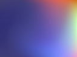
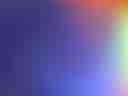
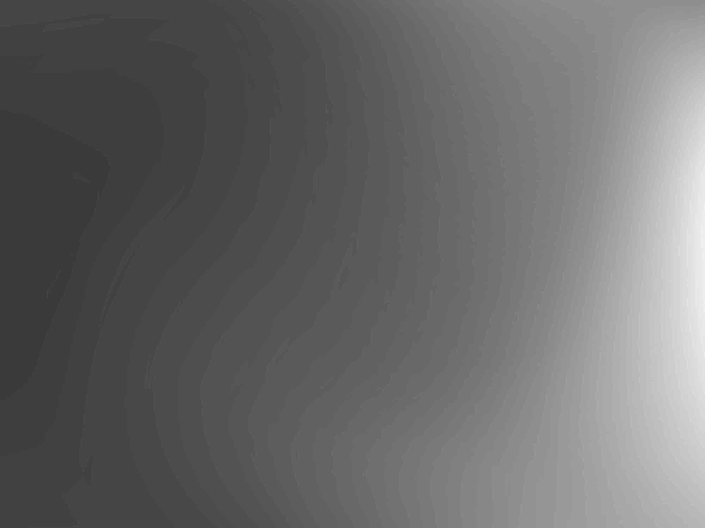
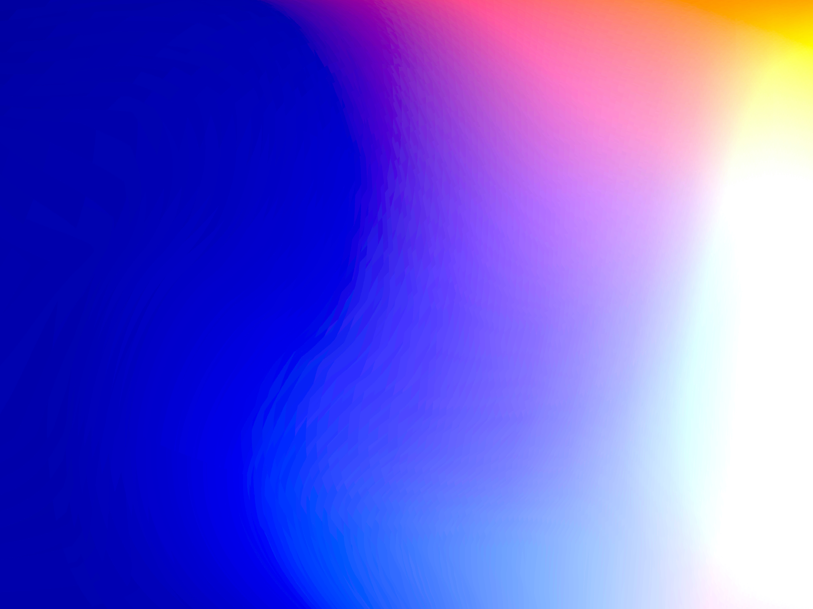
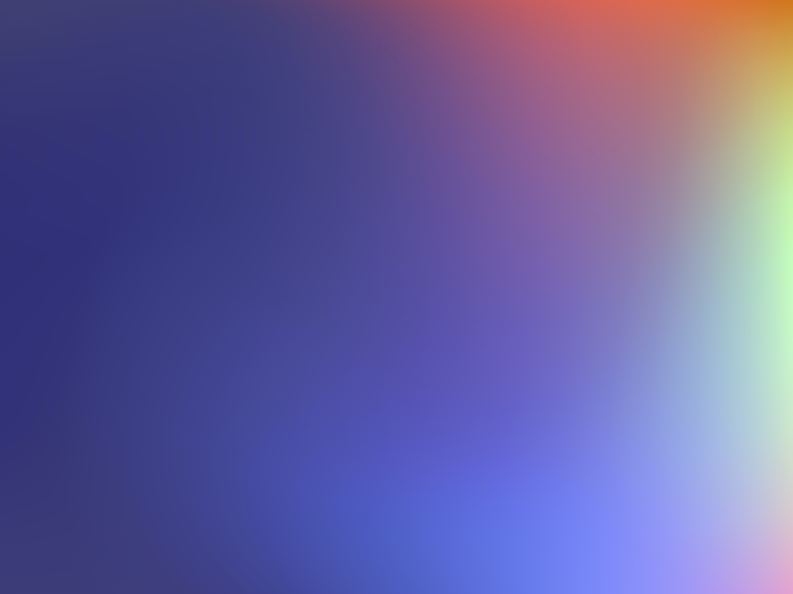
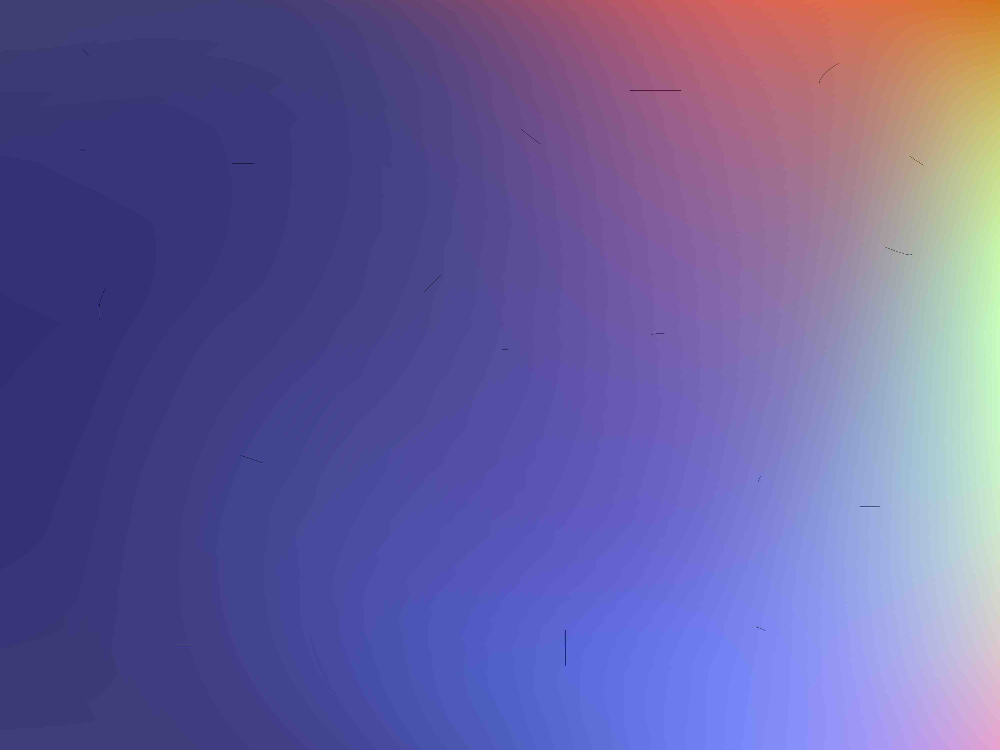
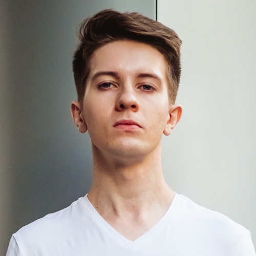

# Примеры изображений для проверки

Ниже приведены примеры изображений с визуальными отличиями от предыдущих, демонстрирующие возможность подменить
оригинальное изображение другим с более высоким разрешением, но вносящее заметные искажения относительно оригинала

#### Миниатюрная версия изображения с соотношением сторон 127:95

#### То же изображение, но с минимальным качеством JPEG и соотношением сторон 4:3

#### Изображение с более высоким разрешением, с наложением ч/б фильтра и тем же соотношением сторон

#### То же изображение, но с фильтром повышающим насыщенность

#### Изображение без одного пикселя по высоте и соотношением сторон 4000:2999

#### Испорченное изображение с более высоким разрешением и соотношением сторон 4:3

#### "Шумное" изображение с соотношением сторон 4000:2999

#### Другое изображение с соотношением сторон 1:1

#### То же изображение с эффектом "размытия" и более высоким разрешением

